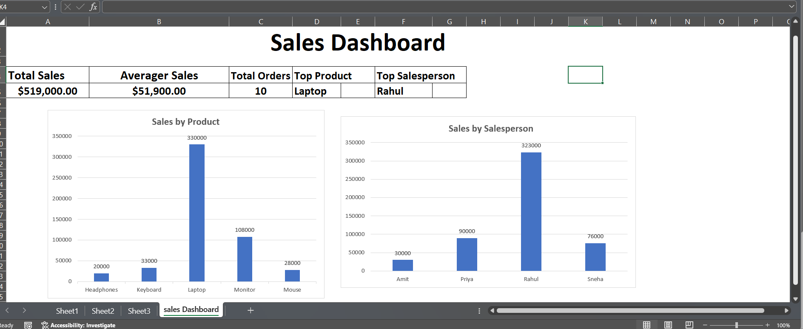

# Sales Dashboard- Microsoft Excel
## Project overview
this project is a sales Dashboard created using Microsoft Excel to analyze sales performance and present key business insights through interactive visualization.
## Objective
Analyze total sales and average sales
Identify the best-performing products
identify the top-performing salesperson
compare sales performance across products and salespersons
Present insights through as easy-to- understand dashboard
## Dashboard Highlights
Total Sales: 519,000
Average sales: 51,900
Total Order: 10
Top product: Laptop
Top Salesperson:Rahul
## Tools and Skills
Microsoft Excel
Data Cleaning
Excel Formulas
Pivot Table/ Pivot Charts
Data visualization
Dashboard Design
Data Analysis
## Project Files
Sales_dashboard_Excel.xlsx.xlsx - Excel workbook contaning the sales data and dashboard
## Key Insights
Laptop generated the highest sales among the products.
rahul was the highest-performing salesperson.
the dashboard provide a quick overview of overall sales performance.
## Dashboard Preview

## Author
Arvind Ganesh
